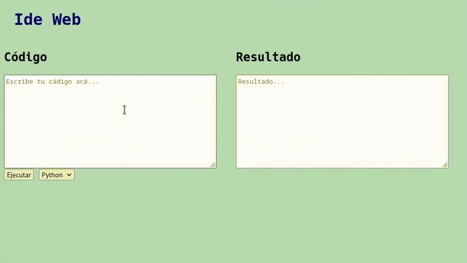

# REST API LANG
This aplication is a REST API for run the language:
- Python
- C++
- Coming soon

## Run the app
```bash
python3 app.py
```

## Sample page
On the root `http://localhost:4000/`



## Run a code

### Request


    wget http://localhost:4000/run/<language>?code=<code_in_base64_url_safe>&datain=<input_in_base64_url_safe>

### Response

    {
      'exit status': '<exit_status>',
      'stdout': '<stdout>',
      'stderr': '<stderr>',
    }
